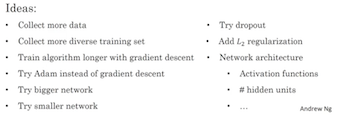

# Structuring Machine Learning Projects

这一课程虽然只有两周，但是非常有价值。在前面理论的基础上带领我们从实际问题中思考，如何真正应用优化我们的模型。很多经验之谈，这正是神经网络称之为艺术的地方。


## WEEK 1: ML Strategy
```
Learning Objectives

Understand why Machine Learning strategy is important
Apply satisficing and optimizing metrics to set up your goal for ML projects
Choose a correct train/dev/test split of your dataset
Understand how to define human-level performance
Use human-level perform to define your key priorities in ML projects
Take the correct ML Strategic decision based on observations of performances and dataset
```


当我们想进一步优化模型的时候，我们会想到很多方法。方法多到我们不可能每种都尝试完然后下结论，那么哪个方向是我们需要的呢？这里提出一种方法Orthogonalization，大致是每次修改一种方法。这节课里将大量涉及不同的误差，bias/variance的问题。




* 第一步，给模型设置一个好的评价标准（evaluation metric）。

```
建议使用唯一一种评价标准，如果有多种评价体系，结果会如何？
使用satisfied metric， 现实中是否有比单一评价更复杂的因素？
怎么获得train/dev/test，不同的任务中我们可能需要不同的比例，同时保证赝本分布一致。
有时候你看到一个预测效率更高的模型，但是你不一定想用，怎么办？
```
* 与人类分辨水平比较（不是bayes level）

```
什么是人类分辨水平，什么是bayes level？
当human error (经常近似bayes error) 与 training error，dev error 不一致时如何处理？
如何估计human level error，bayes error？采用哪些人的水平呢？
```

* 如何提高训练效果？

training set 效果好 + 模型在未知数据表现良好。可以用不同数据集的误差来探讨。

```
Human level > training error > dev error, 通过误差的比较可以决定下一步如何提高模型效果。
```

* 采访[Andrej Karpathy](http://cs.stanford.edu/people/karpathy/)

```
0：00 你是如何深入到机器学习来的？
2：15 你现在是图像识别比赛中的human benchmark，如何做到的？（2周的时间专门给数据打标示。。）
6：10 你为deep learning领域熟知的一个因素是公开了课堂视频 (cs231n)，谈谈你的想法。
7:50 很多人都加入这个迅速发展的领域，你对deep learning的发展什么看法。
10:10 你经常参与AI未来的讨论中，能讲讲你的看法么？
13:15 现在又很多人想进入这个领域，你有什么建议？(implement from a scratch your self)
```


## WEEK 2: Multi-task Leanring
```
Learning Objectives

Understand what multi-task learning and transfer learning are
Recognize bias, variance and data-mismatch by looking at the performances of your algorithm on train/dev/test sets
```

* 错误分析
当模型表现不佳的时候，手动检查算法表现错误的地方可能会给你数据的有价值的信息。

```
猫的图像识别识别中，猫的识别会有狗的图像污染，怎么做？
手机数据中，有label错误的情况么，如何处理? (DL are robust for random error.)
建立模型的时候，最好先建baseline模型，然后iteratively修改。
```

* 训练集和验证/测试集不一致

```
（1）测试的数据往往是不可以很好预支的，例如构建图像识别的app，怎么办？
（2）使用training-dev set来分析training和dev数据是否同一分布。bias/variance/mismatch
（3）了解到数据存在问题后，如何克服data mismatch problem。
```

(1) 问题需要注意，如果用手中的20k图像识别，但是用户通过app传入的2k照片不符合原始训练数据分布。课程提供的解决方案是，20k+1k作为训练数据，1k用户数据作为dev数据，1k用户数据作为测试数据。这样虽然训练数据依然和测试数据分布不一致。但是保证了dev数据跟用户数据一致。这样可以帮助了解模型的bias。

(3) 找出测试数据出现mismatch的原因，模拟出测试数据。

* 迁移学习, learning from multiple task

	当你已经有一个根据大量数据训练很好的模型，可以利用该模型训练较小的数据来完成新的任务。这些任务有共同的特点，共享一些低层面的特征。

```
什么时候使用迁移学习？为什么迁移学习管用？
使用一个神经网络来完成多任务学习（multi-task learning）？
```

* end to end deep learning

过去的机器学习训练需要分几个步骤，每一步学习一个任务。神经网络可以做到end to end的学习，即输入原始数据，输出直接是你想要的任务结果。中间过程全由神经网络学习完成。例如以前的语音识别模型，需要通过声学模型先对声音进行处理，提取feature，然后根据feature进行学习单词，再由单词组成最终结果。

end to end 模型的优势。（1）让数据说话，（2）简化手工设计过程。缺点是（1）可能需要更多的数据，（2）可能有一些有效的手工设计的feature可以使用的。是否使用end to end模型的关键是是否有足够的数据训练。

```
end to end 模型与之前的模型有什么区别？什么时候用end to end的模型？
更多的例子解释什么时候使用end to end的模型。
```

* 采访[Ruslan Salakhutdinov](http://www.cs.cmu.edu/~rsalakhu/)

```
工作于apple，CMU教授
0:00 你是怎么进入deep learning领域的
2:00 能讲些更多当时的工作么？
4:00 当时很多关于Boltzmann Machine的工作，当时发生了什么。
7:20 你做过generative supervised和 unsupervised方面的工作，能介绍下这方面的进展么？
10:50 你对最近想进入deep learning领域的人有什么建议？ TRY DIFFERNT THINGS！
12:00 Academic vs Industry
15:00 除了无监督学习，还有什么前沿领域么？deep reinforce learning，natural language learning， one-shot learning/ transfer learning
```