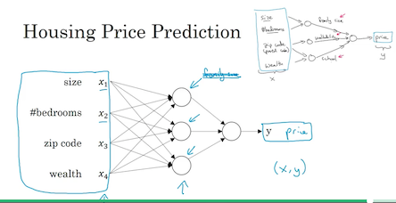
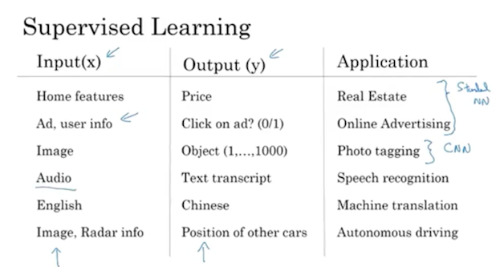

### welcome to the Deep Learning Specialization

#### Introduce to Deep Learning
1. What is a neural network

	从房价预测的例子来理解，房价多少与房子大小相关。如果知道房子大小我们可以预测房价。这个关系就可以用一个node的神经网络节点来简单估计。（当然这个问题在数学上可以直接可以求解的，但往往很多问题不能显示用数学表达式求出。）。视频中提到了神经网络中最最经典的一个kernel， relu。
	
	那么如果我们知道房子的信息很多的时候怎么办呢？这时候就需要很多的节点，这些节点构成神经网络。（请不要被神经网络这个名词吓到了！）。其实就跟我们刚结束函数这个名词一样，其实是一种建立输入输出连接的方式。

名词： relu

2. Supervised Learning with Neural Networks

机器学习有很多种的分类方式，监督学习/无监督学习是分类中的一种。监督学习中，我们拿到的训练数据是标签好的。注意**一般**情况，神经网络需要大量的数据训练，因此如何制造有效的labeled的训练集很重要。著名教授Feifei Li的贡献就是构建了Image的数据集。后来著名的图像识别神经网络都是根据这个数据集展示的，大家也通过这个数据集的预测结果来现实自己算法的优越性。但是现在的神经网络的识别率已经大大高于人眼，失败率只有小数点后几位，因此可能需要更大更好的数据集。其他领域也有很多著名的数据集。同时也有一些小的数据集，例如UCI数据集。

名词：supervised learning, structured/ unstructured data.

3. Why is Deep Learning taking off?

为什么神经网络最近这么火，其实神经网络经历了三次起伏。但是都没能真正到达应用的程度，这一次人工智能的热潮真正将神经网络推向应用。为什么呢？简单的说就是new data，new algorithm, new CPU GPU。这些都让神经网络的训练faster。[神经网络的发展历史](http://www.cnblogs.com/subconscious/p/5058741.html#fifth)这篇博文，可以让你迅速的一时到这么多年历史是怎么起起伏伏的。这个视频中大神推荐了一幅图，画的很好。

#### Geoffrey Hilton Interview
这个长达40分钟的视频中，两位大神通过网络侃侃而谈。你如果不知道Geoffrey Hilton是谁，那么就赶紧google吧。强烈建议观看。
